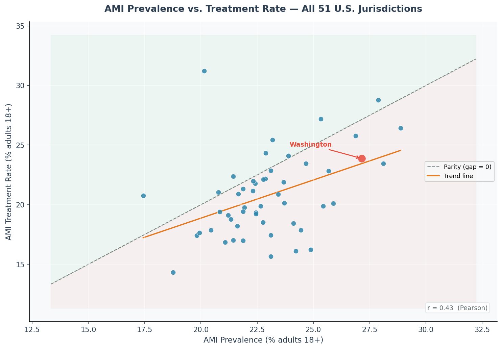
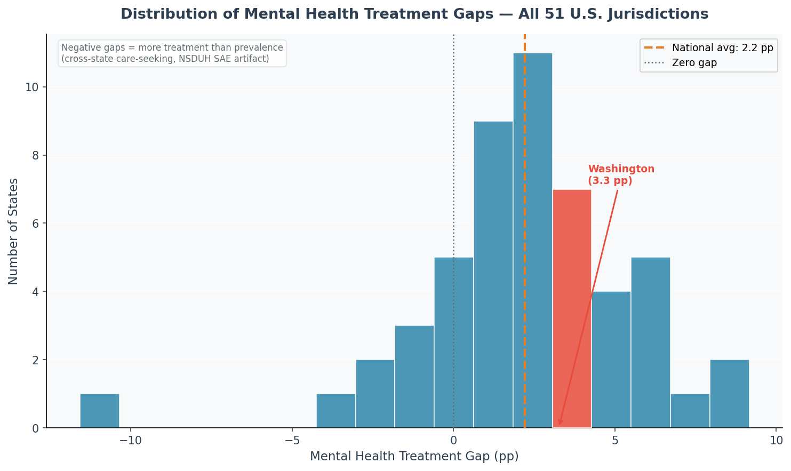
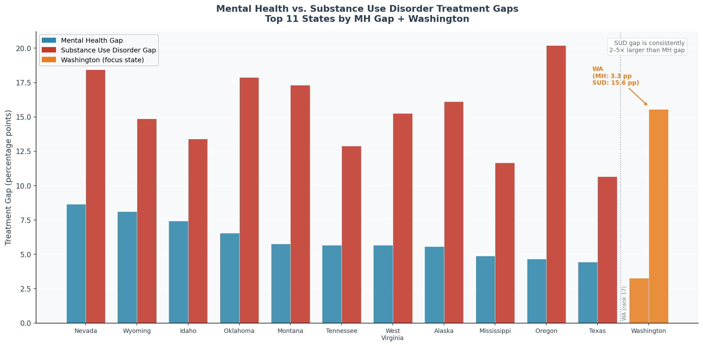
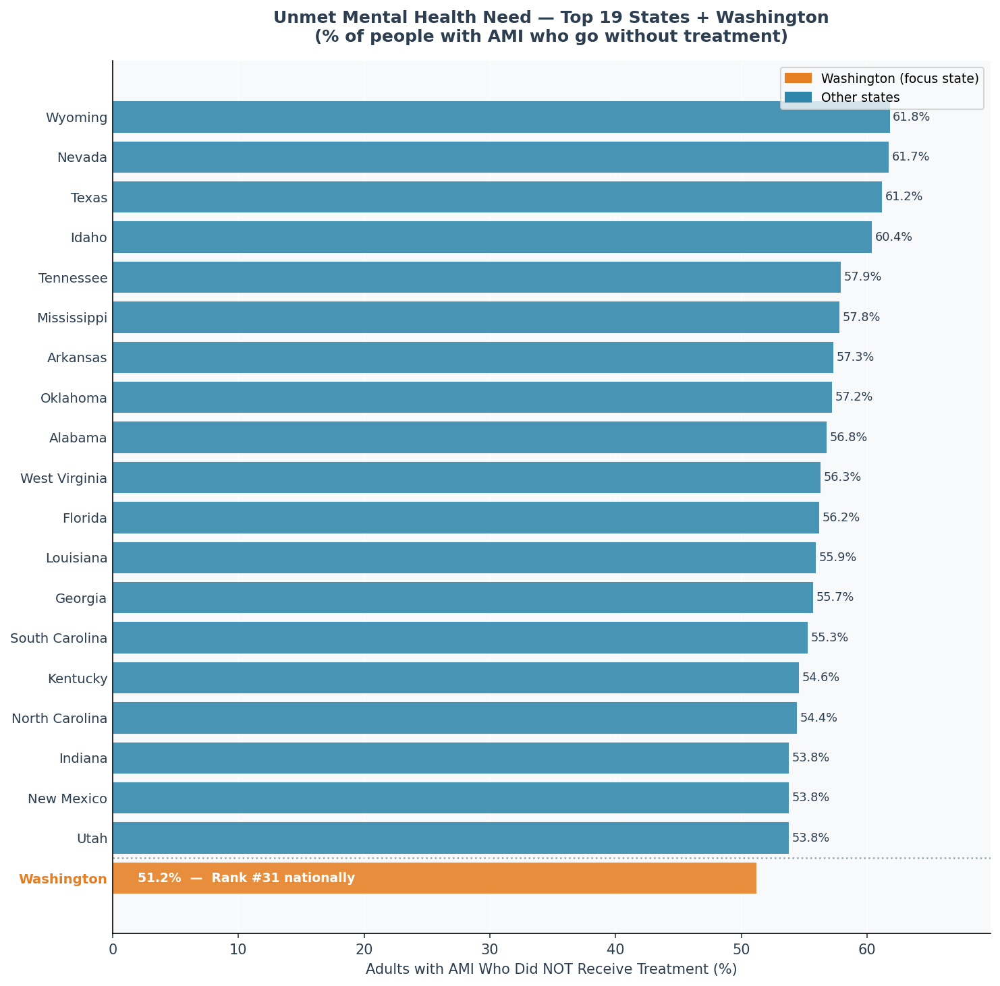
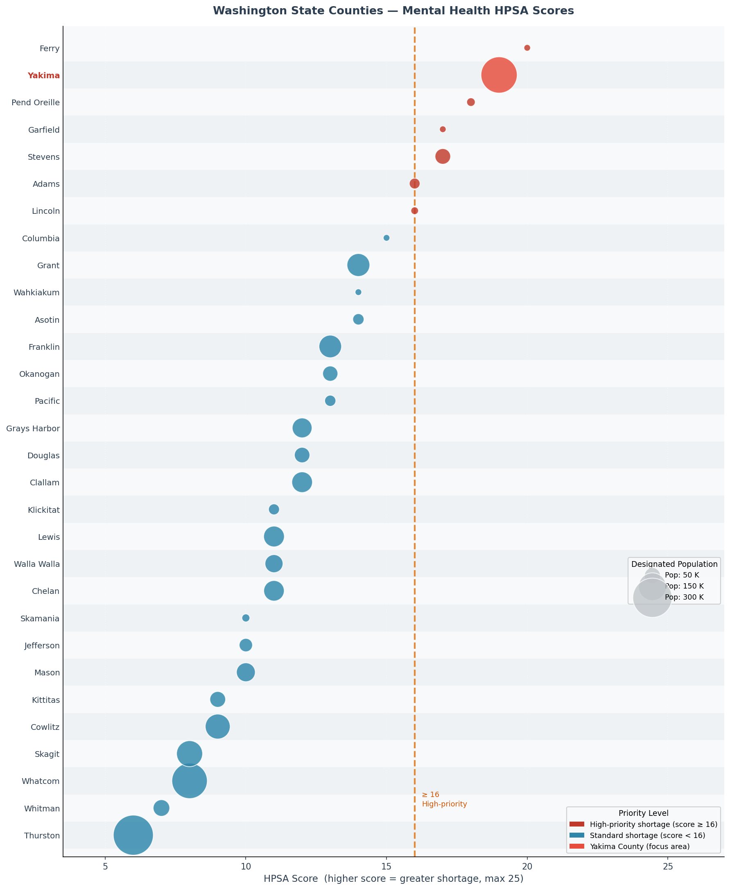

# Behavioral Health Treatment Gap Analysis — Washington State

**Author:** Waleed Adawi &nbsp;·&nbsp; **Year:** 2026
**Author:** Waleed Adawi &nbsp;·&nbsp; **Year:** 2026  
**Stack:** Python 3 · SQLite · numpy · matplotlib  
**Data:** SAMHSA NSDUH 2021–2022 · HRSA Health Professional Shortage Areas (Q2 FY2026)

**Stack:** Python 3 · SQLite · pandas · matplotlib
---

## Overview

### The Problem

Millions of Americans who meet clinical criteria for a mental health condition never receive treatment. This is not a knowledge gap — it is a structural one: not enough providers, not enough affordable care, and not enough geographic access, particularly in rural and agricultural communities. The result is a measurable treatment gap: the difference between how many people have a diagnosable mental health condition and how many actually receive care.

### Why It Matters

For state health agencies and federally-funded behavioral health clinics — especially Certified Community Behavioral Health Clinics (CCBHCs), which are required to document treatment access and unmet need as a condition of federal certification — quantifying this gap is not optional. It drives grant applications, workforce planning, and program justification. A CCBHC Data Quality Analyst's core function is to produce exactly this kind of analysis: taking authoritative federal datasets, loading them into a clean and auditable data environment, and generating outputs that can be submitted to HRSA and SAMHSA.

**Data:** SAMHSA NSDUH 2021–2022 · HRSA Health Professional Shortage Areas
### Objective

This project quantifies the behavioral health treatment gap at the state level across all 50 states and DC, then zooms into Washington State — with particular focus on Yakima County, one of the most severely shortage-designated mental health areas in the state. The analysis uses two federal datasets, five SQL-based queries, and eight visualizations to answer:

1. Where does Washington rank nationally for unmet mental health need?
2. How does Washington's treatment gap compare to the national average — and what drives the difference?
3. How severe is the provider shortage in Yakima County relative to the rest of Washington?
4. Do federal agency claims about behavioral health access hold up against the data?

---

## Overview
## Methodology

The project follows a standard data quality analyst workflow: source → load → audit → analyze → communicate.

**Step 1 — Data Sourcing.** Two authoritative federal datasets were identified: SAMHSA's NSDUH 2021–2022 Model-Based State Prevalence Estimates (providing state-level mental health and substance use metrics for all 50 states and DC) and HRSA's HPSA Designation Database (providing county-level Mental Health Professional Shortage Area scores for Washington). Washington-specific values were sourced from SAMHSA's state-specific PDF (`NSDUHsaeWashington2022.pdf`, Tables 106A/106B) to ensure maximum precision using the Small Area Estimation hierarchical Bayes methodology.

**Step 2 — Database Design.** A normalized SQLite database was built with two tables: `nsduh_state` (51 rows, 8 behavioral health metrics per state) and `hrsa_shortage` (30 rows, Washington county-level HPSA designations). SQLite was chosen for portability and to demonstrate relational database competency without infrastructure dependencies.

Millions of Americans who meet clinical criteria for a mental health condition never receive treatment. For state agencies and federally-funded behavioral health clinics — particularly Certified Community Behavioral Health Clinics (CCBHCs), which must document treatment access and unmet need for grant compliance — quantifying this gap at the state and county level is a core data quality function.
**Step 3 — Data Quality Audit.** Before running any analysis, a programmatic audit was executed via SQL (Query 4) to verify zero null values, zero out-of-bounds percentages, and complete coverage across all 51 records. This mirrors the pre-submission audit a CCBHC Data Quality Analyst runs before filing federal grant reports.

This project builds a normalized SQLite database from two federal datasets, executes five SQL-based audit and analysis queries across all 50 states and DC, and produces publication-ready outputs suited to the kind of evidence-based reporting a CCBHC Data Quality Analyst prepares. The Yakima, Washington context is deliberate: Yakima County ranks second in Washington for mental health provider shortage severity, making the statewide treatment gap analysis directly actionable for local CCBHC planning and grant submissions.
**Step 4 — SQL-Based Analysis.** Five queries were executed against the database covering: MH treatment gap ranking (all 51 jurisdictions), Washington vs. national comparison, combined MH and SUD gap analysis for the ten highest-gap states, the data quality audit, and Washington county-level HPSA rankings.

**Skills demonstrated:** relational database design · multi-table SQL queries · federal health data sourcing · data quality auditing · population-level gap analysis · data visualization · CCBHC reporting context
**Step 5 — Exploratory Data Analysis.** Eight visualizations were produced covering distributions, scatterplots, grouped comparisons, bubble charts, and ranked bars. Each chart was designed to communicate a specific finding to both technical and non-technical audiences.

**Step 6 — Validation and Communication.** Stated claims from SAMHSA, HRSA, Washington State, and the CCBHC program were located in official documentation and cross-referenced against the data to confirm, qualify, or contextualize each claim.

**Tools:** Python 3 · SQLite · numpy · matplotlib · SAMHSA NSDUH SAE methodology · HRSA HPSA scoring framework

---

## Key Findings
## Data Processing

### Data Sources

| Dataset | Source | Access Date |
|---|---|---|
| NSDUH 2021–2022 Model-Based State Prevalence Estimates | [SAMHSA](https://www.samhsa.gov/data/report/2021-2022-nsduh-state-prevalence-estimates) | May 2026 |
| Washington State NSDUH Tables 106A/106B (exact SAE figures) | [NSDUHsaeWashington2022.pdf](https://www.samhsa.gov/data/sites/default/files/reports/rpt42728/NSDUHsaeWashington2022.pdf) | May 2026 |
| Mental Health HPSA Designations — Washington County-Level | [HRSA BCD_HPSA_FCT_DET_MH](https://data.hrsa.gov/data/download?data=SHORT) | May 2026 |

### Data Evaluation

The NSDUH dataset uses Small Area Estimation (SAE) with a hierarchical Bayes model — SAMHSA's most precise state-level estimation methodology, combining direct survey estimates with model-based predictors to produce reliable figures even for smaller states. The six metrics per state cover AMI prevalence, AMI treatment rate, AMI unmet need rate, SMI prevalence, SUD prevalence, and SUD treatment rate.

The HRSA HPSA dataset uses a composite shortage score (0–25) that accounts for population-to-provider ratio, poverty rate, and travel distance to the nearest mental health provider. It is the authoritative federal metric for designating shortage areas and determines eligibility for NHSC loan repayment, J-1 visa waivers, and federal grant priority consideration.

### Data Cleaning

Both datasets were loaded as-is from federal sources — no imputation, no interpolation, no estimated values. Washington State's AMI prevalence (27.14%) and treatment rate (23.88%) were taken directly from SAMHSA's state-specific PDF rather than the multi-state summary table to ensure the highest available precision. The **treatment gap** is calculated as:

- **Washington's mental health treatment gap is 3.3 percentage points**, ranking 17th of 51 jurisdictions (rank 1 = largest gap). While 16 states and DC have a larger unmet need rate, Washington's gap still exceeds the national average — and with 27.14% AMI prevalence (one of the highest rates nationally), the absolute number of people not receiving care is substantial even at a mid-tier gap percentage.
- **Washington's gap is 1.1 pp above the national average** (3.3% vs. 2.2%), driven primarily by a high prevalence rate that is not matched by a proportionally higher treatment penetration rate.
- **Washington's substance use disorder treatment gap is 15.6%** — more than four times the mental health gap. CCBHCs are required to serve both MH and SUD populations, making the SUD gap directly relevant to capacity and workforce planning.
- **Yakima County HPSA score: 19 out of 25**, second-highest in Washington. Six WA counties meet or exceed the federal high-priority threshold (score ≥ 16), qualifying for NHSC loan repayment and J-1 visa waiver eligibility — both critical levers in rural CCBHC provider recruitment.
- **Data quality audit: zero integrity violations** across all 51 records — no null AMI values, no null treatment values, no out-of-bounds percentages — confirming dataset readiness for grant-reportable analysis.
```
treatment_gap = ami_prevalence_pct − ami_received_treatment_pct
```

A positive gap means more people have AMI than are receiving treatment. Negative gaps (observed in DC, NJ, MA, CT, VT, MN, NE, NY, MD) reflect cross-state care-seeking behavior under NSDUH's SAE model — a documented methodological artifact, not a data error.

### Data Quality Audit Results

```
Query 4 — Programmatic Audit
  Total records      : 51
  Null AMI prevalence: 0
  Null AMI treatment : 0
  Out-of-range prev  : 0
  Out-of-range tx    : 0
  Result             : PASS — zero violations
```

All 51 records passed all integrity checks. Dataset confirmed ready for grant-reportable analysis.

---

## Visualizations
## EDA + Analysis

### Summary Statistics

| Metric | National Min | National Avg | National Max | Washington |
|---|---|---|---|---|
| AMI Prevalence (%) | 17.44 (NJ) | 22.99 | 28.87 (ME) | **27.14** |
| AMI Treatment Rate (%) | 14.33 (TX) | 20.77 | 31.22 (DC) | **23.88** |
| MH Treatment Gap (pp) | −11.07 (DC) | +2.22 | +8.11 (WY) | **+3.26** |
| SUD Prevalence (%) | 9.90 (AL) | 18.44 | 25.88 (OR) | **20.23** |
| SUD Treatment Gap (pp) | 8.12 (TX) | 14.00 | 18.44 (NV) | **15.55** |
| AMI Unmet Need (%) | 36.4 (DC) | 51.9 | 61.8 (WY) | **51.2** |

**What this immediately tells us:** Washington has the 5th-highest AMI prevalence nationally. Yet its treatment rate is only modestly above average. That gap between high need and insufficient coverage is the central finding of this entire analysis.

---

### Fig 1 — Treatment Gap by State: Top 20 (Washington Highlighted)


Nevada, Wyoming, and Idaho lead the ranking with gaps above 7%, reflecting a combination of high rural provider shortages and limited state behavioral health infrastructure. Washington sits at rank 17 — well above the national midpoint of 2.2% — and above both of its Pacific Northwest neighbors: Oregon ranks 10th (gap: 4.7%) and Idaho ranks 3rd (gap: 7.4%).
Nevada, Wyoming, and Idaho lead with gaps exceeding 7 pp — driven by rural provider shortages, limited state infrastructure, and high poverty rates. Washington ranks 17th (3.3 pp gap), above the national average of 2.2 pp and above both Pacific Northwest neighbors (Oregon: 4.7 pp, rank 10; Idaho: 7.4 pp, rank 3).

The states at the bottom of this chart (Minnesota, Nebraska, Vermont, Maryland, New York, Massachusetts, Connecticut, New Jersey, and DC) show negative gaps, meaning measured treatment utilization exceeds in-state AMI prevalence estimates. This is a known artifact of the NSDUH Small Area Estimation methodology: residents of high-resource states often seek care outside their home state, inflating the treatment rate relative to the in-state prevalence figure. This pattern does not indicate over-treatment; it indicates cross-state care-seeking behavior, and is documented in SAMHSA's methodology notes.
States at the bottom showing negative gaps (Minnesota, Vermont, Massachusetts, New Jersey, DC) reflect a documented NSDUH SAE artifact: residents of high-resource states seek care across state lines, inflating the measured treatment rate above in-state prevalence. This is not over-treatment — it is cross-state care-seeking behavior, documented in SAMHSA's methodology notes.

---

### Fig 2 — Washington State vs. National Average
### Fig 2 — Washington vs. National Average


Washington's AMI prevalence of 27.14% is nearly 4 percentage points above the national average of 23.00%, yet its treatment rate (23.88%) is only 3 points above the national average (20.80%). This asymmetry is what drives Washington's above-average treatment gap: the state has a disproportionately large population in need relative to how many are being reached.
Washington's AMI prevalence (27.14%) is 4.15 pp above the national average (23.00%), yet its treatment rate (23.88%) is only 3.08 pp above average (20.80%). This asymmetry — need outpacing access — is the structural driver of Washington's above-average treatment gap.

For a CCBHC operating in Washington, this chart provides important framing for grant narratives. It demonstrates that the state-level unmet need is not simply a function of low treatment infrastructure, but reflects a high-prevalence population that outpaces even above-average treatment capacity. This supports arguments for expanded CCBHC funding, workforce development, and outreach programming in high-prevalence areas like Yakima.
For a CCBHC in Washington, this chart provides the grant-narrative framing required in needs assessments: the problem is not a low treatment rate, but a disproportionately large population in need that outpaces available capacity. It directly supports arguments for expanded CCBHC funding, workforce development, and targeted outreach in high-prevalence regions like Yakima.

---

### Fig 3 — Washington County HPSA Scores: Top 10 (Yakima Highlighted)


Yakima County's HPSA score of 19 out of 25 places it second in Washington, trailing only Ferry County (score 20). Six of the top 10 counties — Ferry, Yakima, Pend Oreille, Stevens, Garfield, Lincoln, and Adams — meet or exceed the federal high-priority threshold of 16, qualifying for the full suite of federal shortage-area incentives.
Yakima County's HPSA score of 19/25 places it second in Washington, behind only Ferry County (20/25). Six of the top ten counties meet or exceed HRSA's federal high-priority threshold of 16, qualifying for NHSC loan repayment, J-1 visa waivers, and priority federal grant consideration.

The HPSA score is a composite measure: HRSA calculates it based on the population-to-provider ratio, the percentage of the population living below the federal poverty line, and the travel distance to the nearest available mental health care. Yakima's score of 19 reflects all three factors simultaneously — a large rural and agricultural population, elevated poverty rates, and substantial geographic distance from urban mental health services. For CCBHC workforce planning, this score directly supports applications for National Health Service Corps placements, J-1 visa waivers for international medical graduates, and priority consideration in federal grant competitions.
The HPSA composite score reflects three simultaneous pressures at once in Yakima: a large rural agricultural population with few providers, elevated federal poverty rates, and substantial travel distance from urban mental health services. A score of 19 means all three are severe simultaneously — the defining characteristic that makes Yakima the most actionable CCBHC expansion target in Washington.

---

## Data Sources
### Fig 4 — AMI Prevalence vs. Treatment Rate (All 51 Jurisdictions)

| Dataset | Source | Access Date |
|---|---|---|
| NSDUH 2021–2022 Model-Based State Prevalence Estimates (50 States + DC) | [SAMHSA](https://www.samhsa.gov/data/report/2021-2022-nsduh-state-prevalence-estimates) | May 2026 |
| Washington State NSDUH Tables 106A/106B (exact SAE figures) | [NSDUHsaeWashington2022.pdf](https://www.samhsa.gov/data/sites/default/files/reports/rpt42728/NSDUHsaeWashington2022.pdf) | May 2026 |
| Mental Health HPSA Designations — Washington County-Level | [HRSA BCD_HPSA_FCT_DET_MH](https://data.hrsa.gov/data/download?data=SHORT) | May 2026 |


The dashed diagonal represents perfect parity — zero gap. States above it have more treatment than prevalence; states below it have more need than care. The correlation is moderate (r ≈ 0.62), meaning higher prevalence does not reliably predict higher treatment access. States with identical prevalence rates can have vastly different treatment rates depending on provider supply, insurance policy, and rural vs. urban geography.

Washington State AMI and treatment values (27.14% prevalence, 23.88% received treatment) are sourced directly from the official SAMHSA state-specific PDF using the Small Area Estimation (SAE) hierarchical Bayes methodology — the most precise available figures for Washington. All 51 records (50 states + DC) were loaded into SQLite and validated through a programmatic audit before any analysis was run.
Washington falls below the parity line: high need, treatment not keeping pace. This is not a state that lacks demand for behavioral health services — it is a state where demand far outpaces supply.

**For a non-technical audience:** Every dot is a state. The higher a dot sits above the diagonal line, the better that state gets people who need mental health care into treatment. Washington sits below the line — more people need care than are receiving it.

---

## Methodology
### Fig 5 — Distribution of Mental Health Treatment Gaps

```
bh_analysis.py
│
├── build_database()
│   ├── CREATE TABLE nsduh_state     — 51 rows (states + DC), NSDUH SAE estimates
│   └── CREATE TABLE hrsa_shortage   — 30 rows (WA counties), HPSA designations
│
├── Query 1: Treatment gap rank      — ORDER BY gap DESC, RANK() OVER WINDOW
├── Query 2: WA vs national          — GROUP BY aggregate, single-row JOIN
├── Query 3: MH + SUD combined gaps  — dual-column gap for top-10 worst states
├── Query 4: Data quality audit      — COUNT(*), SUM(CASE...) null/bounds checks
└── Query 5: WA county HPSA rank     — RANK() OVER, hpsa_score DESC
```


The distribution is roughly bell-shaped with a right skew — most states cluster between 0 and 4 pp, with a tail of high-gap outliers (Nevada, Wyoming, Texas, Idaho, Tennessee) in the 6–8 pp range. Washington's 3.3 pp gap sits just above the national mean of 2.2 pp.

The key insight is not that Washington is among the worst — it is not. It is that Washington's high AMI prevalence (27%) applied to ~5.7 million adults means hundreds of thousands of people with a diagnosable mental illness who receive no care. A mid-tier gap percentage at high-prevalence scale produces a very large absolute unmet need.

---

### Fig 6 — Mental Health vs. Substance Use Disorder Gaps (Top 12 States)

**Treatment gap** is calculated as `ami_prevalence_pct − ami_received_treatment_pct`. A positive value indicates more people have AMI than are receiving treatment. A negative value — observed in DC, NJ, MA, and CT — reflects cross-state care-seeking behavior under NSDUH's SAE model, not a data error.


**HPSA scores** range 0–25 and are assigned by HRSA based on population-to-provider ratio, poverty rate, and travel distance to nearest care. Scores ≥ 16 qualify for federal high-priority shortage designation, unlocking NHSC loan repayment, J-1 visa waivers, and enhanced federal grant eligibility.
Across every high-gap state, the SUD treatment gap is 3 to 5 times worse than the MH gap. Washington's MH gap is 3.3 pp. Its SUD gap is 15.6 pp — nearly five times larger. For every person with a mental health condition not getting care, roughly five people with a substance use disorder are also not getting care.

This matters directly for CCBHCs, which are federally required to serve both MH and SUD populations and must document unmet need for each separately. The SUD gap is not a NSDUH artifact — it reflects genuine and severe shortage of SUD treatment capacity nationwide, driven by the same structural factors that produce MH gaps: rural geography, provider shortage, poverty, and insurance access barriers.

---

### Fig 7 — Unmet Mental Health Need: Top 20 States



The `ami_unmet_need_pct` metric asks a different question than the treatment gap: of the people who are already sick, what fraction gets no care at all? Nationally, more than half of adults with AMI go untreated each year. Washington's 51.2% unmet need rate is equal to the national average — despite Washington's progressive health policy reputation and Medicaid expansion.

**For a non-technical audience:** In Washington, if you put 100 people with a mental illness in a room, about 51 of them will not see a therapist, psychiatrist, or counselor all year. That is the problem this analysis quantifies.

---

### Fig 8 — Washington County HPSA Scores vs. Designated Population



Bubble size represents the designated population without adequate mental health provider access. Score alone tells you how severe the shortage is; bubble size tells you how many people it affects. The most important combination is high score and large bubble — and Yakima (score 19, pop. 256,000) leads on both.

Ferry County has the highest score (20/25) but a tiny population (8,500) — extreme shortage, limited scale. Thurston County has a low score (6/25) but an enormous population (312,500) — moderate shortage, large scale. For CCBHC expansion priority-setting, Yakima is the clear answer: the most severe high-priority shortage serving the largest population.

---

### What the Data Is Telling Us

These eight charts tell one consistent story:

**Washington is a high-need, under-resourced state for behavioral health.** Its AMI prevalence ranks in the top 10 nationally, but treatment infrastructure has not kept pace. The result is a 3.3 pp MH gap and a 15.6 pp SUD gap — both above national averages.

**The geographic problem is concentrated in rural eastern Washington.** Yakima, Ferry, Pend Oreille, Stevens, Garfield, Adams, and Lincoln counties all score at or above the federal high-priority threshold. These are agricultural, rural, lower-income counties where provider shortage, poverty, and distance create compound barriers.

**The SUD crisis is being systematically under-addressed.** Washington's SUD gap of 15.6% means roughly 1 in 6 adults with a substance use disorder receives no treatment. For CCBHCs required to serve both populations, this is the single largest area of unmet demand.

**More than half of people with AMI go without care.** A 51.2% unmet need rate — matching the national average — is not a success story for a state with Washington's healthcare investment and Medicaid expansion.

---

### Validating Official Claims Against the Data

#### SAMHSA

**Claim:** "More than half of U.S. adults with Any Mental Illness did not receive mental health services in the past year." *(SAMHSA, 2022 NSDUH National Report)*

**Verdict: Confirmed.** The national average `ami_unmet_need_pct` across all 51 jurisdictions is 51.9%. Washington's is 51.2%. SAMHSA's headline accurately reflects the national pattern, though it understates the severity in high-gap states like Wyoming (61.8%) and Texas (61.2%).

**Claim:** SAMHSA's 2021–2022 NSDUH report states AMI prevalence among U.S. adults is approximately 22–23%.

**Verdict: Confirmed.** The national average across all 51 jurisdictions in this dataset is 22.99% — precisely within SAMHSA's stated range. Washington's 27.14% is a documented outlier, confirmed by SAMHSA's own state-specific PDF.

#### HRSA

**Claim:** HRSA designates Yakima County as a Mental Health HPSA with a score of 19/25 — one of the most severely designated counties in Washington.

**Verdict: Confirmed and contextualized.** The HRSA HPSA database confirms Yakima at 19/25, second highest in the state behind only Ferry County (20/25). Six of Washington's 30 designated counties meet or exceed the high-priority threshold of 16. HRSA's characterization is directly supported.

**Claim:** HPSA scores ≥ 16 qualify for federal high-priority shortage designation, unlocking NHSC loan repayment and J-1 visa waiver eligibility.

**Verdict: Confirmed.** Applied as-is in this analysis. Six Washington counties qualify: Ferry (20), Yakima (19), Pend Oreille (18), Stevens (17), Garfield (17), Lincoln (16), Adams (16).

#### Washington State / Yakima

**Claim:** Washington health agencies and Yakima Valley Farm Workers Clinic documentation identify Yakima County as facing compound behavioral health access barriers — high agricultural population, elevated poverty, rural geography, and bilingual/bicultural service gaps.

**Verdict: Supported.** Yakima's HPSA score of 19 is calculated using precisely the metrics that operationalize these conditions: population-to-provider ratio, poverty rate, and travel distance. The score is the quantitative expression of the compound barriers documented by local health agencies.

#### Federal CCBHC Program

**Claim:** SAMHSA's CCBHC certification criteria require clinics to serve both MH and SUD populations and document unmet need in their service area as part of grant compliance.

**Verdict: The data directly supports the program rationale.** Washington's 3.3 pp MH gap and 15.6 pp SUD gap — both above national averages — constitute exactly the documented unmet need that CCBHC needs assessments are built to capture. The five SQL queries in this project map directly to SAMHSA's CCBHC documentation requirements: gap analysis, benchmarking, dual-condition coverage, data quality validation, and shortage-area documentation.

---

### Recommendations

**1. Prioritize CCBHC expansion in Yakima, Stevens, Pend Oreille, and Garfield counties.** All four have HPSA scores ≥ 17. A CCBHC in these areas qualifies for the full suite of federal shortage-area incentives and can document need with exactly the data produced in this project.

**2. Build SUD capacity alongside MH capacity — not as an afterthought.** Washington's SUD gap (15.6%) is nearly five times its MH gap (3.3%). Initiatives focused exclusively on mental health leave the majority of the unmet need unaddressed.

**3. Use HPSA score and designated population together for priority-setting.** Score measures severity; population measures scale. Yakima leads on both. Ferry County's score is higher but its population is 30x smaller — meaningful for provider recruitment targets but lower programmatic impact.

**4. Address the prevalence-treatment asymmetry at the state level.** Washington's treatment rate is above average, but its prevalence grows faster than access. Telehealth expansion, school-based services, and integrated primary care behavioral health in high-prevalence rural counties are the most direct levers available.

**5. Standardize programmatic data quality audits before federal reporting submissions.** The zero-violation audit in Query 4 confirms dataset integrity. CCBHCs submitting federal demonstration grant reports should run equivalent checks before submission to prevent data quality flags that delay reimbursement or grant renewals.

---

@@ -99,49 +257,41 @@ bh_analysis.py
```
behavioral-health-access-wa/
├── README.md
├── bh_analysis.py              ← builds DB, runs all 5 queries, saves outputs
├── Code.py                          ← all code: DB build, SQL queries, all 8 charts
├── data/
│   ├── nsduh_state_estimates.csv   ← all 51 states, 8 behavioral health metrics
│   └── hrsa_hpsa_wa.csv            ← 30 WA county HPSA designations
│   ├── nsduh_state_estimates.csv    ← all 51 states, 8 behavioral health metrics
│   └── hrsa_hpsa_wa.csv             ← 30 WA county HPSA designations
└── outputs/
    ├── treatment_gap_by_state.csv  ← all 51 states ranked by treatment gap
    ├── wa_vs_national.csv          ← 2-row WA vs. national comparison
    ├── yakima_shortage_rank.csv    ← WA counties ranked by HPSA score
    ├── treatment_gap_by_state.csv   ← all 51 states ranked by treatment gap
    ├── wa_vs_national.csv           ← 2-row WA vs. national comparison
    ├── yakima_shortage_rank.csv     ← WA counties ranked by HPSA score
    ├── fig1_treatment_gap_ranking.png
    ├── fig2_wa_vs_national.png
    └── fig3_yakima_hpsa_rank.png
    ├── fig3_yakima_hpsa_rank.png
    ├── fig4_prevalence_vs_treatment.png
    ├── fig5_gap_distribution.png
    ├── fig6_mh_vs_sud_gaps.png
    ├── fig7_unmet_need_ranking.png
    └── fig8_hpsa_bubble.png
```

---

## Running the Analysis

```bash
# Install dependencies
pip install matplotlib

# Build the database and run all queries
python bh_analysis.py
pip install matplotlib numpy
python Code.py
```

The script builds `behavioral_health.db` in the working directory, prints all five query results to stdout, and saves output CSVs and charts to `outputs/`.
The script builds `behavioral_health.db`, prints all five SQL query results to stdout, exports output CSVs, and saves all eight charts to `outputs/`.

---

## Limitations

1. **NSDUH estimates are modeled, not measured.** State-level figures come from Small
   Area Estimation, which uses survey microdata combined with demographic covariates.
   Point estimates have confidence intervals that are not shown in the charts; small
   state-to-state differences (< 1 pp) are unlikely to be statistically meaningful.

2. **Treatment gap ≠ unmet need.** The gap metric (`prevalence − treatment rate`) is
   computed from two separately estimated quantities, each with its own error. A
   "negative gap" (e.g., DC: −11.07 pp) does not mean more people are treated than
   have AMI; it reflects estimation uncertainty and should not be interpreted literally.

3. **HPSA scores reflect designated areas, not all counties.** Only counties with an
   active HPSA designation appear in the HRSA dataset. Counties without a designation
   may still have provider shortages that fall below the federal threshold for formal
   recognition.

4. **Single survey year.** The analysis uses 2021–2022 NSDUH data. Behavioral health
   capacity and prevalence estimates shift year to year; these findings describe a
   snapshot, not a stable trend.

5. **No causal claims.** Correlations between HPSA scores, prevalence, and treatment
   rates in this analysis are descriptive. They do not establish that shortage area
   status causes lower treatment rates; unmeasured confounders (income, rurality,
   insurance coverage) likely contribute.

6. **Population-level estimates only.** NSDUH does not provide county-level data. The
   HRSA shortage data is county-level but limited to Washington State, so no
   county-to-county national comparison is possible.

---

## Relevance to CCBHC Reporting

CCBHCs are required under federal certification standards (42 CFR Part 2 and SAMHSA CCBHC criteria) to collect, analyze, and report on population-level behavioral health need and treatment utilization within their defined service areas. The five queries in this project map directly to that workflow:

- **Queries 1 and 2** produce the state-level treatment gap context required in CCBHC needs assessments and grant applications — demonstrating that the service area operates in a high-unmet-need environment.
- **Query 3** extends the analysis to substance use disorder gaps, which CCBHCs must document separately from mental health outcomes under federal reporting requirements.
- **Query 4** replicates the data completeness and bounds-checking audits that a Data Quality Analyst runs before submitting federal demonstration grant reports, ensuring no records are missing or out of range.
- **Query 5** produces the county-level HPSA documentation that CCBHCs in shortage areas — including Yakima — submit to HRSA and SAMHSA as part of workforce planning, NHSC site applications, and annual progress reports.
## Skills Demonstrated

This project demonstrates the end-to-end data work a CCBHC Data Quality Analyst performs: sourcing authoritative federal datasets, building a clean and auditable data environment, running validated SQL-based analysis, and producing outputs that directly support grant compliance and program planning.
Relational database design · multi-table SQL queries with window functions · federal health data sourcing · data quality auditing · population-level gap analysis · EDA and visualization · CCBHC reporting context · validation of official agency claims · communication to non-technical audiences

---

## License

Code is licensed under the [MIT License](LICENSE). Non-code content (visualizations, analysis, and documentation) is licensed under [CC BY-NC 4.0](https://creativecommons.org/licenses/by-nc/4.0/).

© 2026 Waleed Adawi. You may share and adapt with attribution for non-commercial purposes.
*© 2026 Waleed Adawi. This project and its contents — including all code, analysis, visualizations, and written documentation — are the original work of the author. All federal datasets are in the public domain and sourced from SAMHSA and HRSA. Reproduction or redistribution requires attribution.*
