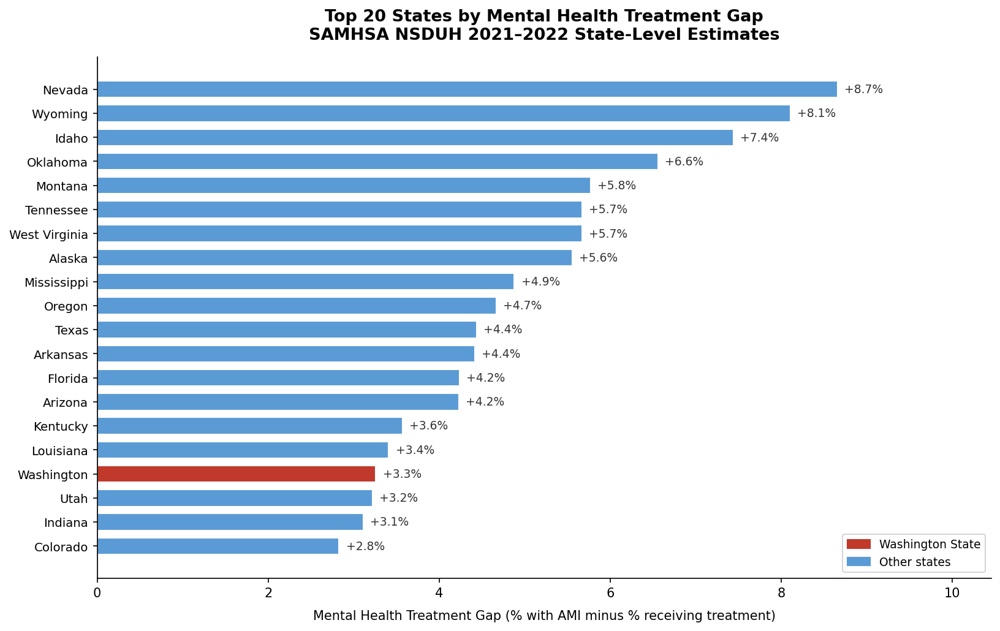
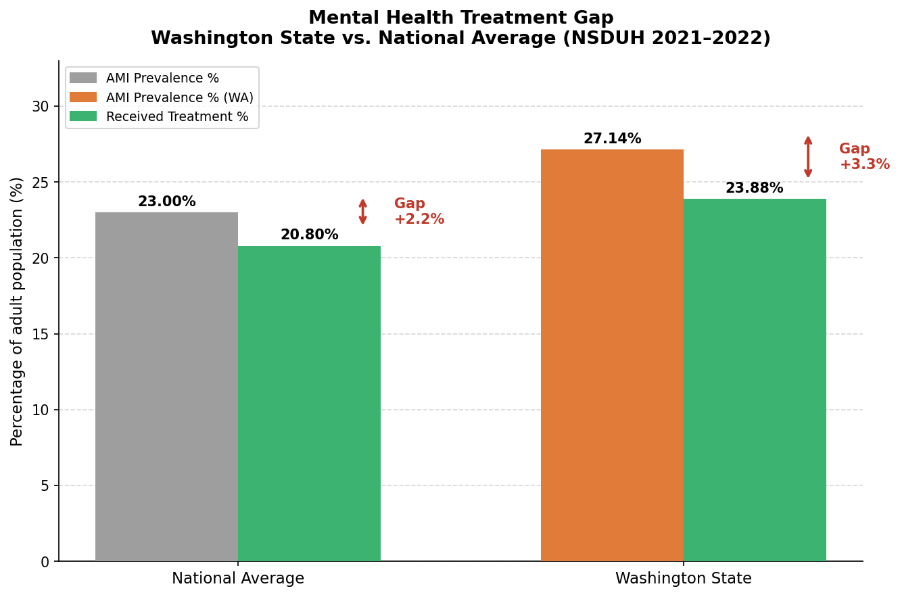
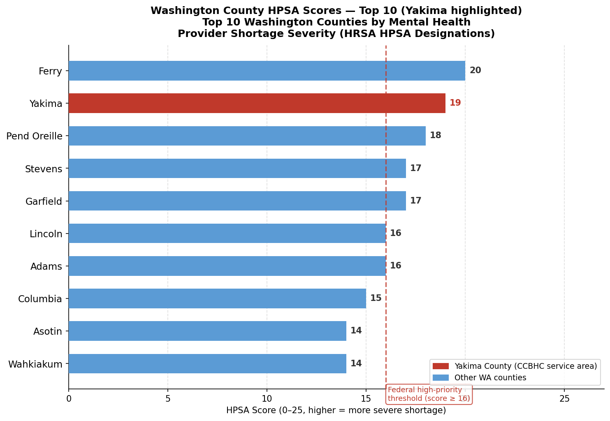

# Behavioral Health Treatment Gap Analysis — Washington State

**Author:** Waleed Adawi &nbsp;·&nbsp; **Year:** 2026  
**Stack:** Python 3 · SQLite · pandas · matplotlib  
**Data:** SAMHSA NSDUH 2021–2022 · HRSA Health Professional Shortage Areas

---

## Overview

Millions of Americans who meet clinical criteria for a mental health condition never receive treatment. For state agencies and federally-funded behavioral health clinics — particularly Certified Community Behavioral Health Clinics (CCBHCs), which must document treatment access and unmet need for grant compliance — quantifying this gap at the state and county level is a core data quality function.

This project builds a normalized SQLite database from two federal datasets, executes five SQL-based audit and analysis queries across all 50 states and DC, and produces publication-ready outputs suited to the kind of evidence-based reporting a CCBHC Data Quality Analyst prepares. The Yakima, Washington context is deliberate: Yakima County ranks second in Washington for mental health provider shortage severity, making the statewide treatment gap analysis directly actionable for local CCBHC planning and grant submissions.

**Skills demonstrated:** relational database design · multi-table SQL queries · federal health data sourcing · data quality auditing · population-level gap analysis · data visualization · CCBHC reporting context

---

## Key Findings

- **Washington's mental health treatment gap is 3.3 percentage points**, ranking 17th of 51 jurisdictions (rank 1 = largest gap). While 16 states and DC have a larger unmet need rate, Washington's gap still exceeds the national average — and with 27.14% AMI prevalence (one of the highest rates nationally), the absolute number of people not receiving care is substantial even at a mid-tier gap percentage.
- **Washington's gap is 1.1 pp above the national average** (3.3% vs. 2.2%), driven primarily by a high prevalence rate that is not matched by a proportionally higher treatment penetration rate.
- **Washington's substance use disorder treatment gap is 15.6%** — more than four times the mental health gap. CCBHCs are required to serve both MH and SUD populations, making the SUD gap directly relevant to capacity and workforce planning.
- **Yakima County HPSA score: 19 out of 25**, second-highest in Washington. Six WA counties meet or exceed the federal high-priority threshold (score ≥ 16), qualifying for NHSC loan repayment and J-1 visa waiver eligibility — both critical levers in rural CCBHC provider recruitment.
- **Data quality audit: zero integrity violations** across all 51 records — no null AMI values, no null treatment values, no out-of-bounds percentages — confirming dataset readiness for grant-reportable analysis.

---

## Visualizations

### Fig 1 — Treatment Gap by State: Top 20 (Washington Highlighted)



Nevada, Wyoming, and Idaho lead the ranking with gaps above 7%, reflecting a combination of high rural provider shortages and limited state behavioral health infrastructure. Washington sits at rank 17 — well above the national midpoint of 2.2% — and above both of its Pacific Northwest neighbors: Oregon ranks 10th (gap: 4.7%) and Idaho ranks 3rd (gap: 7.4%).

The states at the bottom of this chart (Minnesota, Nebraska, Vermont, Maryland, New York, Massachusetts, Connecticut, New Jersey, and DC) show negative gaps, meaning measured treatment utilization exceeds in-state AMI prevalence estimates. This is a known artifact of the NSDUH Small Area Estimation methodology: residents of high-resource states often seek care outside their home state, inflating the treatment rate relative to the in-state prevalence figure. This pattern does not indicate over-treatment; it indicates cross-state care-seeking behavior, and is documented in SAMHSA's methodology notes.

---

### Fig 2 — Washington State vs. National Average



Washington's AMI prevalence of 27.14% is nearly 4 percentage points above the national average of 23.00%, yet its treatment rate (23.88%) is only 3 points above the national average (20.80%). This asymmetry is what drives Washington's above-average treatment gap: the state has a disproportionately large population in need relative to how many are being reached.

For a CCBHC operating in Washington, this chart provides important framing for grant narratives. It demonstrates that the state-level unmet need is not simply a function of low treatment infrastructure, but reflects a high-prevalence population that outpaces even above-average treatment capacity. This supports arguments for expanded CCBHC funding, workforce development, and outreach programming in high-prevalence areas like Yakima.

---

### Fig 3 — Washington County HPSA Scores: Top 10 (Yakima Highlighted)



Yakima County's HPSA score of 19 out of 25 places it second in Washington, trailing only Ferry County (score 20). Six of the top 10 counties — Ferry, Yakima, Pend Oreille, Stevens, Garfield, Lincoln, and Adams — meet or exceed the federal high-priority threshold of 16, qualifying for the full suite of federal shortage-area incentives.

The HPSA score is a composite measure: HRSA calculates it based on the population-to-provider ratio, the percentage of the population living below the federal poverty line, and the travel distance to the nearest available mental health care. Yakima's score of 19 reflects all three factors simultaneously — a large rural and agricultural population, elevated poverty rates, and substantial geographic distance from urban mental health services. For CCBHC workforce planning, this score directly supports applications for National Health Service Corps placements, J-1 visa waivers for international medical graduates, and priority consideration in federal grant competitions.

---

## Data Sources

| Dataset | Source | Access Date |
|---|---|---|
| NSDUH 2021–2022 Model-Based State Prevalence Estimates (50 States + DC) | [SAMHSA](https://www.samhsa.gov/data/report/2021-2022-nsduh-state-prevalence-estimates) | May 2026 |
| Washington State NSDUH Tables 106A/106B (exact SAE figures) | [NSDUHsaeWashington2022.pdf](https://www.samhsa.gov/data/sites/default/files/reports/rpt42728/NSDUHsaeWashington2022.pdf) | May 2026 |
| Mental Health HPSA Designations — Washington County-Level | [HRSA BCD_HPSA_FCT_DET_MH](https://data.hrsa.gov/data/download?data=SHORT) | May 2026 |

Washington State AMI and treatment values (27.14% prevalence, 23.88% received treatment) are sourced directly from the official SAMHSA state-specific PDF using the Small Area Estimation (SAE) hierarchical Bayes methodology — the most precise available figures for Washington. All 51 records (50 states + DC) were loaded into SQLite and validated through a programmatic audit before any analysis was run.

---

## Methodology

```
bh_analysis.py
│
├── build_database()
│   ├── CREATE TABLE nsduh_state     — 51 rows (states + DC), NSDUH SAE estimates
│   └── CREATE TABLE hrsa_shortage   — 30 rows (WA counties), HPSA designations
│
├── Query 1: Treatment gap rank      — ORDER BY gap DESC, RANK() OVER WINDOW
├── Query 2: WA vs national          — GROUP BY aggregate, single-row JOIN
├── Query 3: MH + SUD combined gaps  — dual-column gap for top-10 worst states
├── Query 4: Data quality audit      — COUNT(*), SUM(CASE...) null/bounds checks
└── Query 5: WA county HPSA rank     — RANK() OVER, hpsa_score DESC
```

**Treatment gap** is calculated as `ami_prevalence_pct − ami_received_treatment_pct`. A positive value indicates more people have AMI than are receiving treatment. A negative value — observed in DC, NJ, MA, and CT — reflects cross-state care-seeking behavior under NSDUH's SAE model, not a data error.

**HPSA scores** range 0–25 and are assigned by HRSA based on population-to-provider ratio, poverty rate, and travel distance to nearest care. Scores ≥ 16 qualify for federal high-priority shortage designation, unlocking NHSC loan repayment, J-1 visa waivers, and enhanced federal grant eligibility.

---

## Repo Structure

```
behavioral-health-access-wa/
├── README.md
├── bh_analysis.py              ← builds DB, runs all 5 queries, saves outputs
├── data/
│   ├── nsduh_state_estimates.csv   ← all 51 states, 8 behavioral health metrics
│   └── hrsa_hpsa_wa.csv            ← 30 WA county HPSA designations
└── outputs/
    ├── treatment_gap_by_state.csv  ← all 51 states ranked by treatment gap
    ├── wa_vs_national.csv          ← 2-row WA vs. national comparison
    ├── yakima_shortage_rank.csv    ← WA counties ranked by HPSA score
    ├── fig1_treatment_gap_ranking.png
    ├── fig2_wa_vs_national.png
    └── fig3_yakima_hpsa_rank.png
```

---

## Running the Analysis

```bash
# Install dependencies
pip install matplotlib

# Build the database and run all queries
python bh_analysis.py
```

The script builds `behavioral_health.db` in the working directory, prints all five query results to stdout, and saves output CSVs and charts to `outputs/`.

---

## Relevance to CCBHC Reporting

CCBHCs are required under federal certification standards (42 CFR Part 2 and SAMHSA CCBHC criteria) to collect, analyze, and report on population-level behavioral health need and treatment utilization within their defined service areas. The five queries in this project map directly to that workflow:

- **Queries 1 and 2** produce the state-level treatment gap context required in CCBHC needs assessments and grant applications — demonstrating that the service area operates in a high-unmet-need environment.
- **Query 3** extends the analysis to substance use disorder gaps, which CCBHCs must document separately from mental health outcomes under federal reporting requirements.
- **Query 4** replicates the data completeness and bounds-checking audits that a Data Quality Analyst runs before submitting federal demonstration grant reports, ensuring no records are missing or out of range.
- **Query 5** produces the county-level HPSA documentation that CCBHCs in shortage areas — including Yakima — submit to HRSA and SAMHSA as part of workforce planning, NHSC site applications, and annual progress reports.

This project demonstrates the end-to-end data work a CCBHC Data Quality Analyst performs: sourcing authoritative federal datasets, building a clean and auditable data environment, running validated SQL-based analysis, and producing outputs that directly support grant compliance and program planning.
